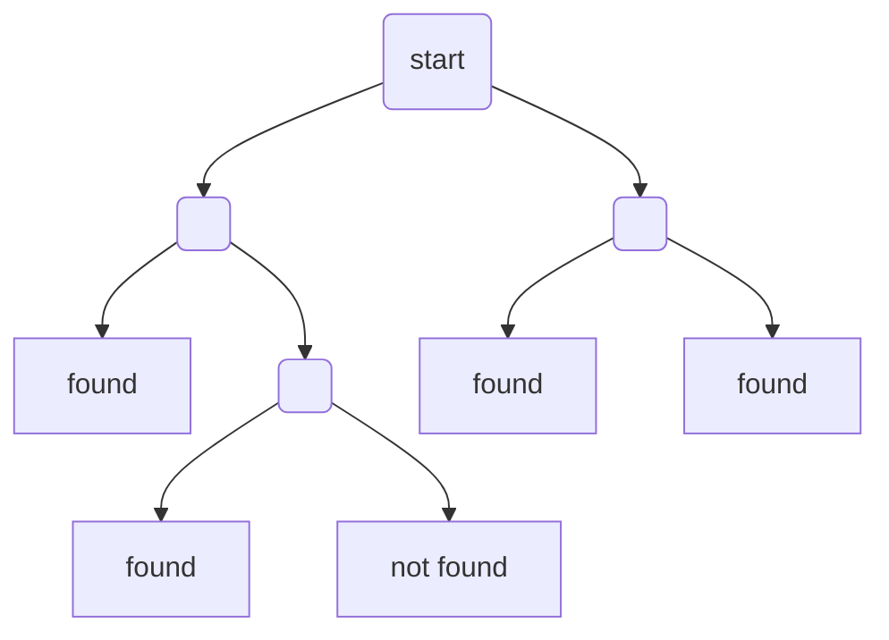

*This is a short note on introductory data structures and algorithms. For more details, [see here](https://ocw.mit.edu/courses/6-006-introduction-to-algorithms-spring-2020/ce9e94705b914598ce78a00a70a1f734_MIT6_006S20_lec4.pdf).*

Consider implementing a fast search algorithm of items in arrays. Say, given an array and a keyword $$k$$, we can compare $$k$$ with each element of the array until we have found the matching item. A brute-force comparison of each item in the array to $$k$$ will cost $$\mathcal{O}(n)$$.

If we have a sorted array (at the cost of creating it at $$\mathcal{O}(n \log n)$$ instead of $$\mathcal{O}(n)$$), then a binary search will to the search job faster at $$\mathcal{O}(\log n)$$.

Can we beat this cap?

## Comparison Model

Under the comparison model, **no**. (But yes if we take a different approach.)

Any (however clever) search algorithm based on comparing items to keyword $$k$$ would have the following shape of its **decision tree**:

If an array has $$n$$ items, then there is a total of $$n+1$$ possible outcomes from the algorithm (a keyword matching to one of the $$n$$ items or "item not found"). They form at least $$n+1$$ leaves of the decision tree, therefor the tree length is capped at $$\mathcal{O}(\log n)$$ as long as a search algorithm follows a comparison model.

## Can a search algorithm be faster than O(log n)?

**Yes**, otherwise I wouldn't have used search engines as much as I actually do. In the [next post]({{ '/_posts/' | relative_url }}), we'll talk about a method using a direct access array (hash table) that enables searching in $$\mathcal{O}(1)$$.
