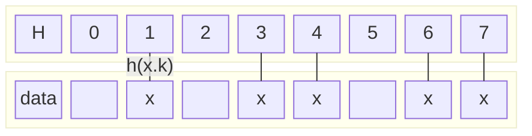

## Comparison Model in Search Algorithms

In the previous post, we discussed how using a comparison model prevents search algorithms from overcoming a certain speed cap.

As long as one has to compare a search key to item keys in a list, any such algorithm cannot be better than having $$\mathcal{O}(\log n)$$ complexity.

However, there's a way to achieve $$\mathcal{O}(1)$$ complexity in searching by not even bothering comparing keys.

The key idea is to have a way $$h$$ to convert each key $$x.\text{key}$$ into an index $$h(x.\text{key})$$ of some array $$H$$ that supports random access ($$\mathcal{O}(1)$$), and store the corresponding item $$x$$ as

$$H[h(x.\text{key})] = x$$

All other slots in $$H$$ should be empty.

## Hashing and beating the Θ(log n) Cap

Roughly speaking, such an array $$H$$ is called a **hash table** (and such function $$h$$ is a **hash function**). Once a hash table is obtained, then the search in $$H$$ of whether a key $$k$$ belongs to it or not is exactly the question of whether $$H[h(k)]$$ exists or not. And since $$H$$ has a random access property, the search is done in $$\mathcal{O}(1)$$.

Especially when $$x.\text{key} = x$$ for all $$x \in X$$, the original question can be rephrased in elementary set-theoretical terms as asking if $$k \in X$$. Using random access $$H$$, the question now can be answered in $$\mathcal{O}(1)$$.

Okay, all sounds great, the speed limit problem is all solved **if** *such hash function and hash table are always available*, and also **if** *there are no other strings attached to the hash table approach.*

In the next post, I'll write more about the ideas and costs of having a hash table $$H$$ itself. (If it costs too much, it might not even be viable to construct it, even if it offers the $$\mathcal{O}(1)$$-search feature.)
